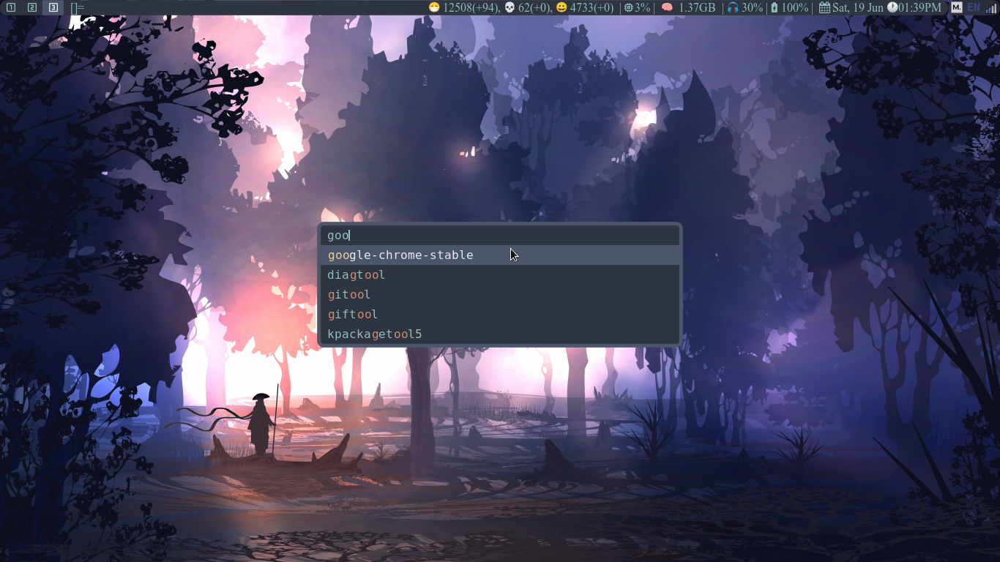
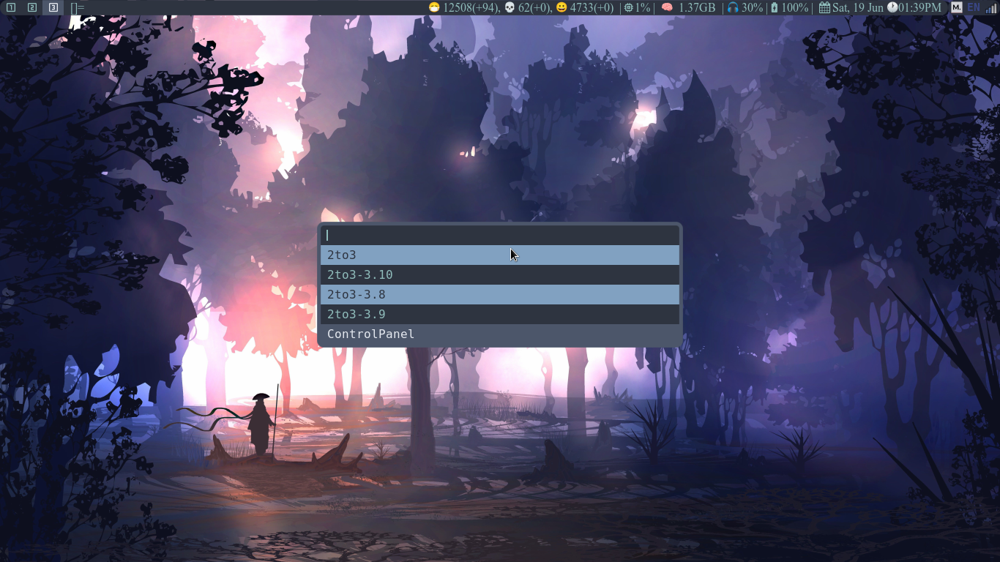

# dmenu - dynamic menu

## About
dmenu is a dynamic menu for X, originally designed for dwm. It manages large numbers of user-defined menu items efficiently. This is a patched dmenu with Nord theme.

## Screenshots




## Patches
This is my custom dmenu build. It contains these patches:
+ [alpha](https://tools.suckless.org/dmenu/patches/alpha/){:target="_blank"}
+ [border](https://tools.suckless.org/dmenu/patches/border/){:target="_blank"}
+ [case-insensitive](https://tools.suckless.org/dmenu/patches/case-insensitive/){:target="_blank"}
+ [center](https://tools.suckless.org/dmenu/patches/center/){:target="_blank"}
+ [emoji-highlight](https://tools.suckless.org/dmenu/patches/emoji-highlight/){:target="_blank"}
+ [fuzzyhighlight](https://tools.suckless.org/dmenu/patches/fuzzyhighlight/){:target="_blank"}
+ [fuzzymatch](https://tools.suckless.org/dmenu/patches/fuzzymatch/){:target="_blank"}
+ [line-height](https://tools.suckless.org/dmenu/patches/line-height/){:target="_blank"}
+ [mouse-support](https://tools.suckless.org/dmenu/patches/mouse-support/){:target="_blank"}
+ [password](https://tools.suckless.org/dmenu/patches/password/){:target="_blank"}

## Installation
Edit config.mk file to match your local setup (st is installed into
the `/usr/local` namespace by default).

Afterwards enter the following command to build and install st:
```
sudo make install clean
```

## Uninstallation
To uninstall dmenu, go to source code folder and run the following command:
```
sudo make uninstall
```

## Configuration
The configuration of st is done by editing the config.def.h file and (re)compiling the source code.
```
sudo make install clean
```
